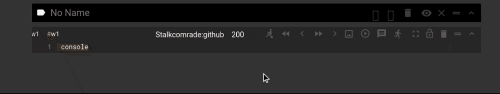
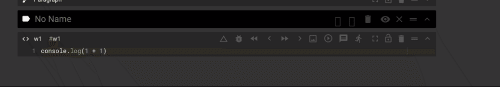
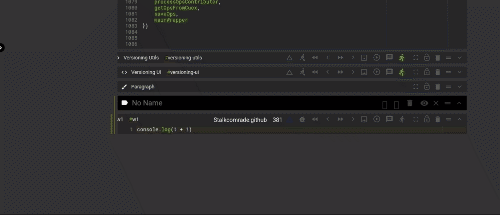
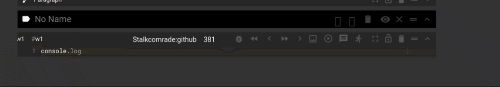

# codestrates-cell-versioning-package
a wrapper for core Webstrates api to enable local versioning for code chunks in Codestrates 

## Packages

[codestrates history navigation package](https://github.com/Stalkcomrade/codestrates-cell-versioning-package/tree/master/packages/USFYpDV9-codestrates-cell-versioning-package)

// TODO: change core codestrate code co capture
// all the execution states

## FIXME: delete one csp file
[codestrates activity component](https://github.com/Stalkcomrade/codestrates-cell-versioning-package/tree/master/packages/RAAJuPq8-activityComponent)

[codestrates history component](https://github.com/Stalkcomrade/codestrates-cell-versioning-package/tree/master/packages/uhAEHyhb-diff-patch-component)

## Components migration

TODO: migration
[inspection components](https://github.com/Stalkcomrade/codestrates-cell-versioning-package/tree/master/packages/MSQ6XRgs-codestrates-vis-components)
